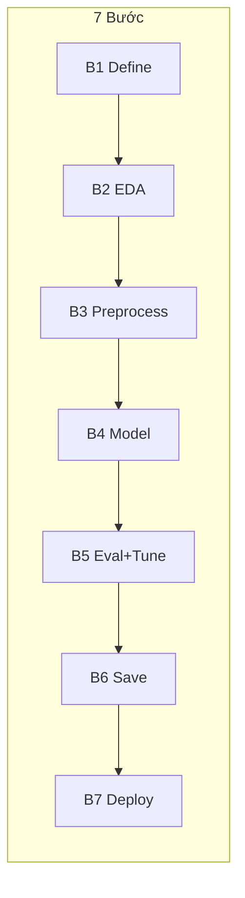

# Mini project có chú thích từng bước – Dataset Iris

## Mục đích

Làm **một bài end-to-end** từ định nghĩa bài toán đến lưu mô hình, với **dataset Iris**. Mỗi bước được gắn rõ "dùng Pandas/sklearn/… để làm gì" để bạn bắt chước khi làm BTL.

---

## Luồng 7 bước và sản phẩm sau mỗi bước



| Bước | Sau bước này bạn có |
|------|----------------------|
| 1 | Mục tiêu, metric, loại bài toán (ghi chú) |
| 2 | DataFrame `df`, vài biểu đồ EDA |
| 3 | `X_train`, `X_test`, `y_train`, `y_test`, `scaler` (dữ liệu đã scale) |
| 4 | Nhiều model đã fit, bảng so sánh sơ bộ |
| 5 | Model tốt nhất đã chọn, metrics đầy đủ, (optional) hyperparameters đã tune |
| 6 | File `model.joblib`, `scaler.joblib`, code load + predict |
| 7 | Flask app chạy được, endpoint `/predict` trả kết quả |

---

## Dataset: Iris

- **Nguồn:** `sklearn.datasets.load_iris()`
- **Loại bài toán:** Classification (3 lớp: setosa, versicolor, virginica)
- **Features:** sepal length/width, petal length/width (số)
- **Target:** species (0, 1, 2)

---

# Bước 1: Định nghĩa bài toán

**Trong bước này ta dùng:** Kiến thức Buổi 3–4 (ML intro, phân biệt Classification/Regression).

**Mục tiêu nhỏ:** Viết rõ bài toán là gì, loại gì, metric đánh giá.

```python
# ============================================
# Bước 1 - Định nghĩa bài toán
# ============================================
# Bài toán: Phân loại loài hoa Iris (3 lớp)
# Loại: Classification
# Metric: Accuracy, F1-score (macro)
# Target: species (setosa, versicolor, virginica)
# ============================================
```

---

# Bước 2: Thu thập và khám phá dữ liệu (EDA)

**Trong bước này ta dùng:** Pandas (DataFrame), Matplotlib/Seaborn (biểu đồ) – đã học ở Module_02, Module_03.

**Mục tiêu nhỏ:** Load data, in shape/info/describe, kiểm tra missing, vẽ phân bố target và correlation heatmap.

```python
# ============================================
# Bước 2 - EDA: dùng Pandas + Seaborn/Matplotlib
# ============================================
import numpy as np
import pandas as pd
import matplotlib.pyplot as plt
import seaborn as sns
from sklearn.datasets import load_iris

# Load data (thu thập)
iris = load_iris()
df = pd.DataFrame(iris.data, columns=iris.feature_names)
df['species'] = iris.target
df['species_name'] = df['species'].map({0: 'setosa', 1: 'versicolor', 2: 'virginica'})

# Khám phá cơ bản
print("Shape:", df.shape)
print("\nInfo:")
print(df.info())
print("\nDescribe:")
print(df.describe())
print("\nMissing values:")
print(df.isnull().sum())

# Phân bố target
print("\nTarget distribution:")
print(df['species'].value_counts())

# Biểu đồ: phân bố target
fig, axes = plt.subplots(1, 2, figsize=(12, 4))
df['species_name'].value_counts().plot(kind='bar', ax=axes[0])
axes[0].set_title('Phân bố loài hoa')
axes[0].set_ylabel('Số lượng')

# Heatmap correlation
sns.heatmap(df[iris.feature_names].corr(), annot=True, cmap='coolwarm', center=0, ax=axes[1])
axes[1].set_title('Correlation giữa các feature')
plt.tight_layout()
plt.show()
```

---

# Bước 3: Tiền xử lý dữ liệu

**Trong bước này ta dùng:** sklearn `train_test_split`, `StandardScaler` – đã học ở Module_04 02_Data_Preprocessing.

**Mục tiêu nhỏ:** Tách X, y; chia train/test (stratify); scale features.

```python
# ============================================
# Bước 3 - Tiền xử lý: train_test_split + StandardScaler
# ============================================
from sklearn.model_selection import train_test_split
from sklearn.preprocessing import StandardScaler

X = df[iris.feature_names]
y = df['species']

# Chia train/test (stratify vì classification, lớp cân bằng)
X_train, X_test, y_train, y_test = train_test_split(
    X, y, test_size=0.2, random_state=42, stratify=y
)

# Scale (fit trên train, transform cả train và test)
scaler = StandardScaler()
X_train_scaled = scaler.fit_transform(X_train)
X_test_scaled = scaler.transform(X_test)

print("Train size:", X_train_scaled.shape[0])
print("Test size:", X_test_scaled.shape[0])
```

---

# Bước 4: Xây dựng mô hình

**Trong bước này ta dùng:** sklearn LogisticRegression, RandomForestClassifier, SVC – đã học ở Module_04 Lab_Classification.

**Mục tiêu nhỏ:** Train 3 model khác loại, in accuracy trên test để so sánh.

```python
# ============================================
# Bước 4 - Modeling: fit nhiều model, so sánh
# ============================================
from sklearn.linear_model import LogisticRegression
from sklearn.ensemble import RandomForestClassifier
from sklearn.svm import SVC

models = {
    'Logistic Regression': LogisticRegression(random_state=42),
    'Random Forest': RandomForestClassifier(random_state=42),
    'SVM': SVC(random_state=42)
}

results = {}
for name, model in models.items():
    model.fit(X_train_scaled, y_train)
    acc = model.score(X_test_scaled, y_test)
    results[name] = acc
    print(f"{name}: Accuracy = {acc:.4f}")

# Chọn model tốt nhất (ví dụ theo accuracy)
best_name = max(results, key=results.get)
best_model = models[best_name]
print(f"\nChọn model: {best_name}")
```

---

# Bước 5: Đánh giá và tinh chỉnh

**Trong bước này ta dùng:** sklearn metrics (classification_report, confusion_matrix), GridSearchCV – đã học ở Module_04 05_Evaluation, Module_05 03_Cross_Validation, 04_Hyperparameter_Tuning.

**Mục tiêu nhỏ:** In classification_report, vẽ confusion matrix; (optional) dùng GridSearchCV để tune.

```python
# ============================================
# Bước 5 - Đánh giá: classification_report, confusion_matrix
# ============================================
from sklearn.metrics import classification_report, confusion_matrix
import seaborn as sns

y_pred = best_model.predict(X_test_scaled)

print("Classification Report:")
print(classification_report(y_test, y_pred, target_names=iris.target_names))

print("Confusion Matrix:")
cm = confusion_matrix(y_test, y_pred)
print(cm)

# Vẽ confusion matrix
plt.figure(figsize=(6, 4))
sns.heatmap(cm, annot=True, fmt='d', cmap='Blues',
            xticklabels=iris.target_names, yticklabels=iris.target_names)
plt.xlabel('Predicted')
plt.ylabel('True')
plt.title('Confusion Matrix - Iris')
plt.show()

# (Optional) Tinh chỉnh hyperparameter với GridSearchCV
# from sklearn.model_selection import GridSearchCV
# param_grid = {'C': [0.1, 1, 10], 'kernel': ['rbf', 'linear']}
# grid = GridSearchCV(SVC(random_state=42), param_grid, cv=5, scoring='accuracy')
# grid.fit(X_train_scaled, y_train)
# best_model = grid.best_estimator_
# print("Best params:", grid.best_params_)
```

---

# Bước 6: Lưu mô hình

**Trong bước này ta dùng:** joblib – đã học ở Module_06 02_Model_Persistence, Lab_01_Model_Persistence.

**Mục tiêu nhỏ:** Lưu model và scaler; viết đoạn load và predict với dữ liệu mới để kiểm tra.

```python
# ============================================
# Bước 6 - Lưu mô hình: joblib.dump / joblib.load
# ============================================
import joblib
import os

os.makedirs('models', exist_ok=True)

# Lưu model và scaler
joblib.dump(best_model, 'models/iris_model.joblib')
joblib.dump(scaler, 'models/iris_scaler.joblib')
print("Đã lưu model và scaler vào thư mục models/")

# Demo: load và predict với dữ liệu mới
loaded_model = joblib.load('models/iris_model.joblib')
loaded_scaler = joblib.load('models/iris_scaler.joblib')

# Lấy 1 mẫu từ test (hoặc tạo mảng mới đúng thứ tự cột)
sample = X_test.iloc[:1]
sample_scaled = loaded_scaler.transform(sample)
pred = loaded_model.predict(sample_scaled)
print(f"\nDemo predict - True: {y_test.iloc[0]}, Predicted: {pred[0]} ({iris.target_names[pred[0]]})")
```

---

# Bước 7: Triển khai (giới thiệu)

**Trong bước này ta dùng:** Flask – đã học ở Buổi 2, Module_06 03_Flask_API_Intro.

**Mục tiêu nhỏ:** Tạo Flask app load model + scaler, endpoint POST `/predict` nhận list features, trả về nhãn dự đoán.

```python
# ============================================
# Bước 7 - Triển khai: Flask API (chạy trong file riêng app.py)
# ============================================
# Lưu đoạn code dưới vào file app.py và chạy: python app.py
# Sau đó gửi request: POST http://localhost:5000/predict
# Body JSON: {"features": [5.1, 3.5, 1.4, 0.2]}

"""
from flask import Flask, request, jsonify
import joblib
import numpy as np

app = Flask(__name__)
model = joblib.load('models/iris_model.joblib')
scaler = joblib.load('models/iris_scaler.joblib')

@app.route('/predict', methods=['POST'])
def predict():
    data = request.json
    features = np.array(data['features']).reshape(1, -1)
    features_scaled = scaler.transform(features)
    pred = model.predict(features_scaled)
    return jsonify({
        'prediction': int(pred[0]),
        'species': ['setosa', 'versicolor', 'virginica'][pred[0]]
    })

@app.route('/health', methods=['GET'])
def health():
    return jsonify({'status': 'ok'})

if __name__ == '__main__':
    app.run(debug=True, port=5000)
"""
```

---

## Kết luận

Sau khi chạy tuần tự từ Bước 1 đến Bước 6 (và Bước 7 nếu có môi trường Flask), bạn đã hoàn thành **một pipeline ML end-to-end** trên dataset Iris. Khi làm BTL với dataset khác, hãy dùng **[Project_Steps_Checklist](Project_Steps_Checklist.md)** và bám theo cùng 7 bước, thay đổi phần load data và tên biến cho phù hợp.
